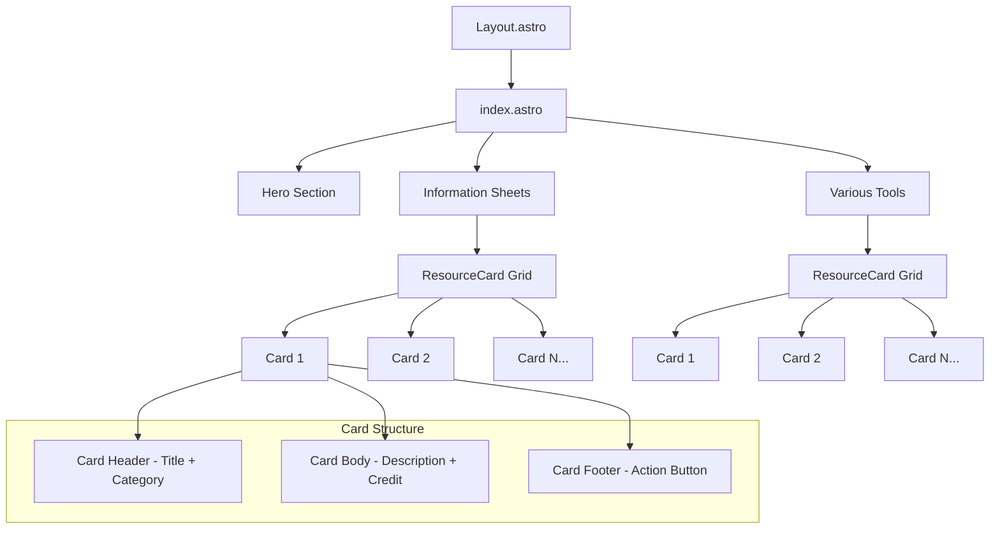

# Arknights Resource Hub Homepage Redesign Plan

## Overview

This plan outlines the complete redesign of the Arknights Resource Hub homepage, transforming raw Discord data into a professional, visually stunning, and responsive web interface with a tactical/industrial dark-mode aesthetic.

## Design Direction

### Color Palette

The new design will use a tactical/industrial aesthetic inspired by the Arknights UI:

| Variable             | Value                                               | Usage                        |
| -------------------- | --------------------------------------------------- | ---------------------------- |
| `--bg-primary`       | `#0a0e14`                                           | Main background - deep black |
| `--bg-secondary`     | `#151a22`                                           | Card backgrounds             |
| `--bg-tertiary`      | `#1a2332`                                           | Elevated surfaces            |
| `--border-color`     | `#2a3444`                                           | Subtle borders               |
| `--text-primary`     | `#e8eaed`                                           | Main text                    |
| `--text-secondary`   | `#8b9db5`                                           | Secondary text               |
| `--accent-primary`   | `#1e90ff`                                           | Primary accent - deep blue   |
| `--accent-secondary` | `#0d6efd`                                           | Hover states                 |
| `--accent-glow`      | `rgba(30, 144, 255, 0.3)`                           | Glow effects                 |
| `--accent-gradient`  | `linear-gradient(135deg, #1e3a5f 0%, #0d1f33 100%)` | Card headers                 |

### Typography

- **Primary Font**: System font stack for performance and readability
- **Headings**: Bold weight, slightly tracked
- **Body**: Regular weight, 1.6 line-height for readability

### Visual Elements

- **Cards**: Subtle borders with hover glow effects
- **Shadows**: Deep shadows with blue tint on hover
- **Animations**: Smooth transitions (0.2-0.3s ease)
- **Icons**: Minimal, functional icons where needed

## Data Structure

### Information Sheets Section

```typescript
const informationSheets = [
  {
    title: "Roadless Camelot - Arknights Info",
    description:
      "Includes: Reroll and Beginner Guides, Mastery and Module Recs, Upcoming Banner Priority, Banner Pity Guide, Top Operator Selection, Limited Banner Off-Rates, Annihilation Overview",
    link: "https://tinyurl.com/ycyfnhyd",
    credit: "500506122227023875",
  },
  {
    title: "Starter Squad Building",
    description: "Visual guide for building effective starter squads",
    link: "https://imgur.com/RnF86SW",
    isImage: true,
  },
  {
    title: "Limited Gacha Odds",
    description: "Information about limited banner gacha probabilities",
    link: "https://tinyurl.com/a4b6xtdy",
    credit: "311675761755029505",
  },
  {
    title: "Module Ratings",
    description: "Comprehensive module ratings and recommendations",
    link: "https://tinyurl.com/5ax8fxbm",
    credit: "253453088843759616",
  },
  {
    title: "Paid Pack Comparison",
    description: "Comparison guide for paid packs and their value",
    link: "https://tinyurl.com/2zv673fp",
    credit: "158427559653146624",
  },
  {
    title: "Mechanics List",
    description: "Comprehensive list of game mechanics",
    link: "https://tinyurl.com/5cux2bbr",
    credit: "792642269966499880",
  },
];
```

### Various Tools Section

```typescript
const variousTools = [
  {
    title: "Arknights Terra Wiki",
    description:
      "Community-maintained wiki with comprehensive game information",
    link: "https://arknights.wiki.gg/wiki/Arknights_Terra_Wiki",
    category: "Wiki",
  },
  {
    title: "PRTS Wiki",
    description: "Chinese wiki with detailed operator and stage information",
    link: "https://prts.wiki/w/%E9%A6%96%E9%A1%B5",
    category: "Wiki",
  },
  {
    title: "Tomimi.dev Wiki",
    description: "Alternative wiki with clean interface",
    link: "https://tomimi.dev/en",
    category: "Wiki",
  },
  {
    title: "Krooster - Roster Tracking",
    description: "Track and plan your operator roster",
    link: "https://www.krooster.com/",
    category: "Planning",
  },
  {
    title: "Puppiiz (Aceship fork)",
    description: "Unit databases, calculators and planner tools",
    link: "https://puppiizsunniiz.github.io/AN-EN-Tags/index.html",
    category: "Database",
  },
  {
    title: "Hermitz Skin Planner",
    description: "Plan and preview operator skins",
    link: "https://hermitzplanner.github.io/skins/",
    category: "Planning",
  },
  {
    title: "map.ARK",
    description: "Interactive stage maps and guides",
    link: "https://map.ark-nights.com/",
    category: "Maps",
  },
  {
    title: "Sanity;Gone Operator List",
    description: "Comprehensive operator database and information",
    link: "https://sanitygone.help/en/operators/",
    category: "Database",
  },
  {
    title: "Penguin-stats Mat Drops",
    description: "Material drop rate statistics and farming planner",
    link: "https://penguin-stats.io/",
    category: "Planning",
  },
  {
    title: "Pull Probability Calc",
    description: "Calculate gacha pull probabilities",
    link: "https://samidare.io/arknights/gacha",
    category: "Calculator",
  },
  {
    title: "Trust Chart",
    description: "Visual trust farming chart",
    link: "https://imgur.com/eybSWuR",
    isImage: true,
    category: "Reference",
  },
  {
    title: "Pull Income Calc",
    description: "Calculate expected pull income over time",
    link: "https://tinyurl.com/428jsp6t",
    category: "Calculator",
  },
];
```

## Component Architecture

### Page Structure

```
Layout.astro
└── index.astro (redesigned)
    ├── Hero Section
    │   └── Title, subtitle, last updated
    ├── Information Sheets Section
    │   └── ResourceCard Grid
    └── Various Tools Section
        └── ResourceCard Grid
```

### ResourceCard Component

The redesigned card will feature:

1. **Card Container**
   - Dark background with subtle border
   - Hover state with blue glow effect
   - Smooth transform animation

2. **Card Header**
   - Deep blue gradient background
   - Category badge (optional)
   - Title as clickable link

3. **Card Body**
   - Description text
   - Credit attribution (if available)

4. **Card Footer**
   - Action button with accent color
   - External link indicator

## CSS Implementation

### New CSS Variables

```css
:root {
  /* Background Colors */
  --bg-primary: #0a0e14;
  --bg-secondary: #151a22;
  --bg-tertiary: #1a2332;

  /* Border & Divider */
  --border-color: #2a3444;
  --border-glow: rgba(30, 144, 255, 0.5);

  /* Text Colors */
  --text-primary: #e8eaed;
  --text-secondary: #8b9db5;
  --text-muted: #5a6a7a;

  /* Accent Colors - Deep Blue */
  --accent-primary: #1e90ff;
  --accent-secondary: #0d6efd;
  --accent-dark: #0b5ed7;
  --accent-glow: rgba(30, 144, 255, 0.3);

  /* Gradients */
  --gradient-card-header: linear-gradient(135deg, #1e3a5f 0%, #0d1f33 100%);
  --gradient-hero: linear-gradient(
    135deg,
    #0d1f33 0%,
    #1e3a5f 50%,
    #0a1628 100%
  );

  /* Shadows */
  --shadow-card: 0 4px 6px rgba(0, 0, 0, 0.3);
  --shadow-card-hover: 0 8px 25px rgba(30, 144, 255, 0.25);

  /* Transitions */
  --transition-fast: 0.15s ease;
  --transition-normal: 0.25s ease;
  --transition-slow: 0.35s ease;
}
```

### Card Styles

```css
.resource-card {
  background-color: var(--bg-secondary);
  border: 1px solid var(--border-color);
  border-radius: 12px;
  overflow: hidden;
  transition: all var(--transition-normal);
  box-shadow: var(--shadow-card);
}

.resource-card:hover {
  transform: translateY(-4px);
  border-color: var(--accent-primary);
  box-shadow: var(--shadow-card-hover);
}
```

## Responsive Design

### Breakpoints

| Breakpoint     | Grid Columns | Layout                 |
| -------------- | ------------ | ---------------------- |
| < 640px        | 1 column     | Single column, stacked |
| 640px - 1024px | 2 columns    | Two column grid        |
| > 1024px       | 3 columns    | Three column grid      |

### Mobile Considerations

- Touch-friendly tap targets (min 44px)
- Readable font sizes (min 16px body)
- Adequate spacing between cards
- Simplified navigation

## Implementation Steps

### Step 1: Update Global CSS

- Replace red accent colors with deep blue palette
- Update background colors to darker tones
- Add new CSS variables for the tactical theme
- Update card hover effects with blue glow

### Step 2: Update ResourceCard Component

- Redesign card header with gradient
- Update button styles
- Add category badge styling
- Implement hover glow effect

### Step 3: Replace index.astro

- Parse Discord data into clean data structures
- Create Information Sheets section
- Create Various Tools section
- Implement hero section with new styling
- Remove sidebar navigation (simplified layout)

### Step 4: Update Header Component

- Update logo styling for new theme
- Adjust header background

### Step 5: Update Footer Component

- Match new color scheme

## Visual Mockup Description

### Hero Section

- Dark gradient background with subtle pattern
- Large title: "Arknights Resource Hub"
- Subtitle: "Community-maintained resources for Arknights players"
- Last updated timestamp

### Information Sheets Section

- Section header with accent underline
- Grid of resource cards
- Each card shows title, description, and action button
- Credits displayed where available

### Various Tools Section

- Similar layout to Information Sheets
- Category badges for tool types
- Clean, organized presentation

## Mermaid Diagram: Component Flow



## Files to Modify

1. **public/styles/global.css** - Complete color palette and styling overhaul
2. **src/pages/index.astro** - Replace with new content and structure
3. **src/components/ResourceCard.astro** - Update card design
4. **src/components/Header.astro** - Update header styling
5. **src/components/Footer.astro** - Update footer styling

## Enhanced Visual Elements

### Contextual Icons for Categories

Each resource category will have a distinctive SVG icon:

| Category   | Icon          | Description              |
| ---------- | ------------- | ------------------------ |
| Wiki       | Book/Document | For wiki resources       |
| Planning   | Chart/Graph   | For planning tools       |
| Database   | Grid/Table    | For database resources   |
| Calculator | Calculator    | For calculation tools    |
| Maps       | Map marker    | For map resources        |
| Reference  | Info circle   | For reference materials  |
| Guide      | Compass       | For guides and tutorials |

### Geometric Patterns on Cards

Subtle background patterns using CSS:

```css
/* Tactical grid pattern overlay */
.resource-card::before {
  content: "";
  position: absolute;
  inset: 0;
  background-image:
    linear-gradient(rgba(30, 144, 255, 0.03) 1px, transparent 1px),
    linear-gradient(90deg, rgba(30, 144, 255, 0.03) 1px, transparent 1px);
  background-size: 20px 20px;
  pointer-events: none;
  opacity: 0.5;
}
```

### Decorative Corner Accents

Arknights-style corner decorations:

```css
/* Top-left corner accent */
.resource-card::after {
  content: "";
  position: absolute;
  top: 0;
  left: 0;
  width: 40px;
  height: 40px;
  border-top: 2px solid var(--accent-primary);
  border-left: 2px solid var(--accent-primary);
  border-top-left-radius: 12px;
  opacity: 0.6;
}
```

### Card Icon Implementation

```astro
<!-- Category icon in card header -->
<div class="card-icon">
  <svg><!-- Category-specific icon --></svg>
</div>
```

## Page Layout with Sidebar

The redesigned homepage will maintain the existing sidebar navigation structure:

```
Layout.astro
└── index.astro (redesigned)
    ├── Hero Section
    │   └── Title, subtitle, last updated
    ├── Page Layout Container
    │   ├── Sidebar Navigation (existing component)
    │   │   └── Quick Navigation Links
    │   └── Main Content Area
    │       ├── Base Resources Section (existing)
    │       ├── Future Content Section (existing)
    │       ├── Efficiency Section (existing)
    │       ├── Utilities Section (existing)
    │       ├── Information Sheets Section (NEW)
    │       └── Various Tools Section (NEW)
```

### Sidebar Navigation Updates

Add new navigation items for the new sections:

```html
<li class="nav-group">
  <strong>Resources</strong>
  <ul>
    <li>
      <a href="#information-sheets" data-parent="resources"
        >Information Sheets</a
      >
    </li>
    <li><a href="#various-tools" data-parent="resources">Various Tools</a></li>
  </ul>
</li>
```

## Complete Data Integration

### Existing Content (Preserved)

The following sections from the current index.astro will be maintained:

1. **Base Resources**
   - Workers
   - Layout & Efficiency
   - Infographics

2. **Future Content**
   - Banners & Sheets
   - Events
   - Skins
   - Farming
   - Modules

3. **Efficiency & Optimization**
   - Info Sheets
   - Infographics

4. **Utilities**
   - Planning Tools
   - Wiki Resources

### New Content (Added)

1. **Information Sheets** (NEW)
   - Roadless Camelot - Arknights Info
   - Starter Squad Building
   - Limited Gacha Odds
   - Module Ratings
   - Paid Pack Comparison
   - Mechanics List

2. **Various Tools** (NEW)
   - Arknights Terra Wiki
   - PRTS Wiki
   - Tomimi.dev Wiki
   - Krooster - Roster Tracking
   - Puppiiz (Aceship fork)
   - Hermitz Skin Planner
   - map.ARK
   - Sanity;Gone Operator List
   - Penguin-stats Mat Drops
   - Pull Probability Calc
   - Trust Chart
   - Pull Income Calc

## Enhanced ResourceCard Component

### New Props

```typescript
export interface Props {
  title: string;
  description: string;
  url: string;
  category?: string;
  categoryIcon?:
    | "wiki"
    | "planning"
    | "database"
    | "calculator"
    | "maps"
    | "reference"
    | "guide";
  isImage?: boolean;
  isYouTube?: boolean;
  credit?: string;
}
```

### Visual Structure

```
┌─────────────────────────────────────────┐
│ ▓▓▓▓▓▓▓▓▓▓▓▓▓▓▓▓▓▓▓▓▓▓▓▓▓▓▓▓▓▓▓▓▓▓▓▓ │
│ [Icon] Title                    [Badge] │
│ ▓▓▓▓▓▓▓▓▓▓▓▓▓▓▓▓▓▓▓▓▓▓▓▓▓▓▓▓▓▓▓▓▓▓▓▓ │
├─────────────────────────────────────────┤
│ ░░░░░░░░░░░░░░░░░░░░░░░░░░░░░░░░░░░░░░ │
│ ░ Description text goes here...       ░ │
│ ░ Credit: @username                   ░ │
│ ░░░░░░░░░░░░░░░░░░░░░░░░░░░░░░░░░░░░░░ │
├─────────────────────────────────────────┤
│                    [Open Resource →]    │
└─────────────────────────────────────────┘

▓ = Gradient header with pattern
░ = Subtle grid pattern overlay
┌┐ = Corner accents
```

## Acceptance Criteria

- [ ] Dark-mode aesthetic with slate greys, deep blacks, and deep blue accents
- [ ] Modern card-based grid layout with enhanced visual elements
- [ ] Mobile-responsive design (works at 320px, 768px, 1024px, 1440px)
- [ ] Clean, sans-serif typography with high readability
- [ ] All Discord formatting artifacts removed
- [ ] Two distinct sections: Information Sheets and Various Tools
- [ ] Each resource displays Title as clickable link and Description
- [ ] Contextual icons for each resource category
- [ ] Subtle geometric patterns/grid overlays on card backgrounds
- [ ] Decorative corner accents matching Arknights tactical aesthetic
- [ ] Sidebar navigation preserved and updated with new sections
- [ ] All existing content integrated alongside new Discord data
- [ ] Smooth hover animations on cards
- [ ] Accessible color contrast ratios
- [ ] Semantic HTML structure
- [ ] Visual enhancements do not overwhelm content readability
